# Java并发编程

[TOC]


## 一、并发编程的基础

### 1.计算机组成原理


#### 1.1 冯·诺依曼计算机的特点

- 计算机由运算器、存储器、控制器、输入设备和输出设备五大部件组成

- 指令(程序)和数据以二进制不加区别地存储在存储器中
- 程序自动运行

运算器和控制器封装到一起，加上寄存器组和cpu内部总线构成中央处理器（CPU）。cpu的根本任 务，就是执行指令，对计算机来说，都是0，1组成的序列，cpu从逻辑上可以划分为3个模块：控制单  元、运算单元和存储单元。这三个部分由cpu总线连接起来。

#### 1.2 cpu原理图

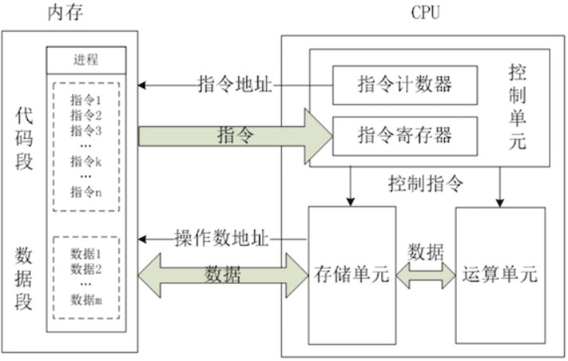 

 

CPU的运行原理就是：控制单元在时序脉冲的作用下，将指令计数器里所指向的指令地址(这个地址是在  内存里的)送到地址总线上去，然后CPU将这个地址里的指令读到指令寄存器进行译码。对于执行指令过  程中所需要用到的数据，会将数据地址也送到地址总线，然后CPU把数据读到CPU的内部存储单元(就是 内部寄存器)暂存起来，最后命令运算单元对数据进行处理加工。周而复始，一直这样执行下去。

#### 1.3 摩尔定律

摩尔定律
由英特尔（Intel）创始人之一戈登·摩尔（Gordon Moore）提出来的
集成电路上可容纳的元器件的数目，约每隔18-24个月便会增加一倍，性能也将提升一倍。

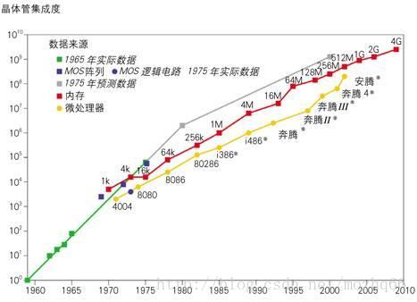

 


对Java而言，对Concurrency/Parallelism支持的不断完善，明显地体现了这一点
–Java 1 支持threads, locks, condition queues
–Java 5 引入了 thread pools, blocking queues, concurrent collections
–Java 7 加入了fork-join库
–Java 8 加入了 parallel streams

### **2.CPU缓存架构**

#### 2.1 多核CPU

**多cup** ： 多个物理CPU，CPU通过总线进行通信，效率比较低。 多cpu的运行，对应进程的运行状态。

**多核cup**： 不同的核可以通过L3 cache进行通信，存储和外设通过总线与CPU通信 。 多核cpu的运行， 对应线程的运行状态。

**CPU寄存器**：每个CPU都包含一系列的寄存器，它们是CPU内内存的基础。CPU在寄存器上执行操作的   速度远大于在主存上执行的速度。这是因为CPU访问寄存器的速度远大于主存。  **CPU缓存**：即高速缓冲存储器，是位于CPU与主内存间的一种容量较小但速度很高的存储器。由于CPU的速度远高于主内存， CPU直接从内存中存取数据要等待一定时间周期，Cache中保存着CPU刚用过或循环使用的一部分数

据，当CPU再次使用该部分数据时可从Cache中直接调用,减少CPU的等待时间，提高了系统的效率。

**内存** ： 一个计算机还包含一个主存，所有的CPU都可以访问主存。主存通常比CPU中的缓存大得多。多cpu和多核cup架构图：


 

 

#### **2.2 缓存一致性问题** 

在多处理器系统中，每个处理器都有自己的高速缓存，而它们又共享同一主内存

（MainMemory）。基于高速缓存的存储交互很好地解决了处理器与内存的速度矛盾，但是也引入了新  的问题：缓存一致性（CacheCoherence）。当多个处理器的运算任务都涉及同一块主内存区域时，将   可能导致各自的缓存数据不一致的情况，如果真的发生这种情况，那同步回到主内存时以谁的缓存数据  为准呢？为了解决一致性的问题，需要各个处理器访问缓存时都遵循一些协议，在读写时要根据协议来  进行操作，这类协议有MSI、   MESI（IllinoisProtocol）、MOSI、Synapse、Firefly及DragonProtocol 等等。

- Lock总线
- 缓存一致性协议（MESI）

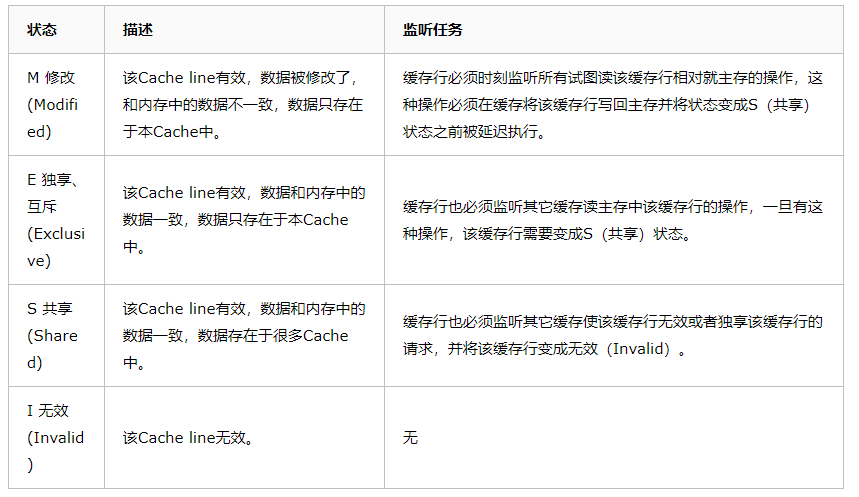


### 3.进程和线程

进程是程序的一次执行，一个程序有至少一个进程，是**资源分配的最小单位**，资源分配包括cpu、内 存、磁盘IO等。线程是**程序执行的最小单位**,**CPU调度的基本单元**，一个进程有至少一个线程。

（1）进程是资源的分配和调度的一个独立单元，而线程是CPU调度的基本单元   

（2）同一个进程中可以包括多个线程，并且线程共享整个进程的资源（寄存器、堆栈、上下文），一个进行至少包括一个线程。  

（3）进程的创建调用fork或者vfork，而线程的创建调用pthread_create，进程结束后它拥有的所有线程都将销毁，而线程的结束不会影响同个进程中的其他线程的结束  

（4）线程是轻两级的进程，它的创建和销毁所需要的时间比进程小很多，所有操作系统中的执行功能都是创建线程去完成的  

（5）线程中执行时一般都要进行同步和互斥，因为他们共享同一进程的所有资源  

（6）线程有自己的私有属性线程控制块TCB，线程id，寄存器、上下文，而进程也有自己的私有属性进程控制块PCB，这些私有属   性是不被共享的，用来标示一个进程或一个线程的标志


 

 

 

### **4.并发和并行**

目标都是最大化CPU的使用率


**并行(parallel)**看，二者都是一起执行的。


 

**并发(concurrency)**：指在同一时刻只能有一条指令执行，但多个进程指令被快速的轮换执行，使得在   宏观上具有多个进程同时执行的效果，但在微观上并不是同时执行的，只是把时间分成若干段，使多个  进程快速交替的执行。


 

并行在多处理器系统中存在，而并发可以在单处理器和多处理器系统中都存在，并发能够在单处理器系  统中存在是因为并发是并行的假象，并行要求程序能够同时执行多个操作，而并发只是要求程序假装同  时执行多个操作（每个小时间片执行一个操作，多个操作快速切换执行）

 

### **5.线程上下文切换**


线程上下文的切换巧妙的利用了**时间片轮转**CPU**线程状态的保存及其再加载，就**  。时间片轮询保证的利用率。


**上下文**：是指再某一时间CPU寄存器和程序计数器的内容；

**寄存器**：是CPU内部数量少但是速度很快的内存。寄存器通常对常用值的快速访问来提高计算机程序运  行的速度；

**程序计数器**：是一个专门的寄存器，用于表明系统中CPU的执行位置，存的值为正在执行的指令或者下  一个需要被执行的指令的位置。

**上下文切换的活动**：

-  a.挂起一个线程，将这个进程在CPU中的状态存储于内存中的某处； 

- b.在内存中检索下一个进程的上下文并将其CPU的寄存器恢复；

- c.跳转到程序计数器所指定的位置；

 

### **6.编译原理**

在编译原理中, 将源代码编译成机器码, 主要经过下面几个步骤:


在Java中**前端编译**是指把**.java**文件转变成**.class**文件的过程; **后端编译**是指把字节码转变成机器码的过 

程。 

前端编译就是javac命令。 

在后端编译阶段， JVM 通过解释字节码将其翻译成对应的机器指令，逐条读入，逐条解释翻译 。 很显 

然，经过**解释执行**，其执行速度必然会比可执行的二进制字节码程序慢很多。这就是传统的JVM的解释 

器（Interpreter）的功能。为了解决这种效率问题，引入了 JIT（即时编译） 技术。 

JAVA程序还是通过解释器进行解释执行，当JVM发现某个方法或代码块运行特别频繁的时候，就会认为 

这是“热点代码”（Hot Spot Code)。然后JIT会把部分“热点代码”**翻译**成本地机器相关的机器码，并进行 

**优化**，然后再把翻译后的机器码**缓存**起来，以备下次使用。 

**JIT(Just In Time Compiler)工作原理**：

工作原理.PNG)

热点探测 （Hot Spot Detection） 

触发JIT，需要识别出热点代码， 有两种方式基于采样的方式探测（Sample Based Hot Spot Detection) ：周期性检测各个线程的栈顶， 

发现某个方法经常出现在栈顶，就认为是热点方法。好处就是简单，缺点就是无法精确确认 

一个方法的热度。容易受线程阻塞或别的原因干扰热点探测。 

基于计数器的热点探测（Counter Based Hot Spot Detection)。采用这种方法的虚拟机会为 

每个方法，甚至是代码块建立计数器，统计方法的执行次数，某个方法超过阀值就认为是热 

点方法，触发JIT编译。 

在HotSpot虚拟机中使用的是第二种——基于计数器的热点探测方法，因此它为每个方法准备了两个计 

数器：方法调用计数器和回边计数器。 

方法计数器：就是记录一个方法被调用次数的计数器。 

回边计数器：是记录方法中的for或者while的运行次数的计数器。 

编译优化 

JIT除了具有缓存的功能外，还会对代码做各种优化。比如 逃逸分析、 锁消除、 锁膨胀、 方法内 

联、 空值检查消除、 类型检测消除、 公共子表达式消除 。 


### **7.安全点** 

safepoint可以用在不同地方，比如GC、Deoptimization，在HotspotVM中，GC safepoint比较常见， 

需要一个数据结构记录每个线程的调用栈、寄存器等一些重要的数据区域里什么地方包含了GC管理的 

指针。 

从线程角度看，safepoint可以理解成是**在代码执行过程中的一些特殊位置，当线程执行到这些位置的** 

**时候，说明虚拟机当前的状态是安全的，如果有需要，可以在这个位置暂停**，比如发生GC时，需要暂 

停所有活动线程，但是该线程在这个时刻，还没有执行到一个安全点，所以该线程应该继续执行，到达 

下一个安全点的时候暂停，然后才开始GC，该线程等待GC结束。 

**安全点的选取** 

在OppMaps的帮助下，虚拟机能够迅速的完成GCRoots的枚举，但是如果每一条指令都生成对应的 

OppMaps，那就需要大量的额外空间。 

所以，程序在执行的时候并非在所有地方都能停顿下来gc，只有到达安全点才能停顿。安全点的选定是 

以“是否具有让程序长时间执行的特性”为标准，因为安全点过少的话gc停顿时间就会很长，安全点过多 

又会增加运行时负荷。”长时间执行“最明显的特征就是指令序列复用，如方法调用，循环跳转，异常跳 

转等。所有这些功能的指令才会产生安全点。 

**线程的停顿** 

在gc发生时让所有线程跑到最近的安全点后停顿。 两种思路： 第一种,抢先式中断,gc发生时，让所有线 

程中断，如果有线程不在安全点，那么让线程跑到安全点。 第二种,主动式中断，设置一个标识，各个 

线程执行时不断轮询这个标志，发现标志时就自动挂起，轮询标志的地方和安全点重合。 

**安全区域** 

安全点机制保证了程序执行的时候，在不太长的时间就会遇到可进入gc的安全点。但是如果线程处于 

sleep状态或者blocked状态的时候，这时线程无法响应jvm的中断请求，就需要安全区域。 

安全区域是指在一段代码片段中，引用关系不会发生变化，在该区域的任何地方发生gc都是安全的。 当 

代码执行到安全区域时，首先标示自己已经进入了安全区域，那样如果在这段时间里jvm发起gc，就不 

用管标示自己在安全区域的那些线程了，在线程离开安全区域时，会检查系统是否正在执行gc，如果是 

那么就等到gc完成后再离开安全区域。 


### **8.happens-before**

从JDK 5 开始，JMM使用happens-before的概念来阐述多线程之间的内存可见性。**在JMM中，如果一** 

个操作执行的结果需要对另一个操作可见，那么这两个操作之间必须存在happens-before关系。

happens-before和JMM关系如下图： 


**happens-before原则定义如下**： 

- 如果一个操作happens-before另一个操作，那么第一个操作的执行结果将对第二个操作可见，而 

且第一个操作的执行顺序排在第二个操作之前。 

- 两个操作之间存在happens-before关系，并不意味着一定要按照happens-before原则制定的顺序 

来执行。如果重排序之后的执行结果与按照happens-before关系来执行的结果一致，那么这种重 

排序并不非法。

**happens-before原则规则**：

- 1.程序次序规则：一个线程内，按照代码顺序，书写在前面的操作先行发生于书写在后面的操作； 

- 2.锁定规则：一个unLock操作先行发生于后面对同一个锁的lock操作； 

- 3.volatile变量规则：对一个变量的写操作先行发生于后面对这个变量的读操作；
- 4.传递规则：如果操作A先行发生于操作B，而操作B又先行发生于操作C，则可以得出操作A先行发生于操作 C；

- 5.线程启动规则：Thread对象的start()方法先行发生于此线程的每个一个动作； 

- 6.线程中断规则：对线程interrupt()方法的调用先行发生于被中断线程的代码检测到中断事件的发生； 

- 7.线程终结规则：线程中所有的操作都先行发生于线程的终止检测，我们可以通过Thread.join()方法结 束、Thread.isAlive()的返回值手段检测到线程已经终止执行； 

- 8.对象终结规则：一个对象的初始化完成先行发生于他的finalize()方法的开始；

>  我们来详细看看上面每条规则（摘自《深入理解Java虚拟机第12章》）： 
>
> **程序次序规则**：一段代码在单线程中执行的结果是有序的。注意是执行结果，因为虚拟机、处理器会对 
>
> 指令进行重排序（重排序后面会详细介绍）。虽然重排序了，但是并不会影响程序的执行结果，所以程 
>
> 序最终执行的结果与顺序执行的结果是一致的。故而这个规则只对单线程有效，在多线程环境下无法保 
>
> 证正确性。 
>
> **锁定规则**：这个规则比较好理解，无论是在单线程环境还是多线程环境，一个锁处于被锁定状态，那么 
>
> 必须先执行unlock操作后面才能进行lock操作。 
>
> **volatile变量规则**：这是一条比较重要的规则，它标志着volatile保证了线程可见性。通俗点讲就是如果 
>
> 一个线程先去写一个volatile变量，然后一个线程去读这个变量，那么这个写操作一定是happens
>
> before读操作的。 
>
> **传递规则**：提现了happens-before原则具有传递性，即A happens-before B , B happens-before C， 
>
> 那么A happens-before C 
>
> **线程启动规则**：假定线程A在执行过程中，通过执行ThreadB.start()来启动线程B，那么线程A对共享变 
>
> 量的修改在接下来线程B开始执行后确保对线程B可见。 
>
> **线程终结规则**：假定线程A在执行的过程中，通过制定ThreadB.join()等待线程B终止，那么线程B在终 
>
> 止之前对共享变量的修改在线程A等待返回后可见。 


**上面八条是原生Java满足Happens-before关系的规则，但是我们可以对他们进行推导出其他满足** 

**happens-before**的规则： 

1.将一个元素放入一个线程安全的队列的操作Happens-Before从队列中取出这个元素的操作 

2.将一个元素放入一个线程安全容器的操作Happens-Before从容器中取出这个元素的操作 

3.在CountDownLatch上的倒数操作Happens-Before CountDownLatch#await()操作 

4.释放Semaphore许可的操作Happens-Before获得许可操作 

5.Future表示的任务的所有操作Happens-Before Future#get()操作 

6.向Executor提交一个Runnable或Callable的操作Happens-Before任务开始执行操作 


### **9.用户态和内核态** 

Linux的架构中，很重要的一个能力就是操纵系统资源的能力。但是，系统资源是有限的，如果不加限 

制的允许任何程序以任何方式去操纵系统资源，必然会造成资源的浪费，发生资源不足等情况。为了减 

少这种情况的发生，Linux制定了一个等级制定，即特权。Linux将特权分成两个层次，以0和3标识。0 

的特权级要高于3。换句话说，0特权级在操纵系统资源上是没有任何限制的，可以执行任何操作，而 

3，则会受到极大的限制。我们把特权级0称之为内核态，特权级3称之为用户态。 

Intel x86架构使用了4个级别来标明不同的特权级权限。R0实际就是内核态，拥有最高权限。而一般应 

用程序处于R3状态--用户态。在Linux中，还存在R1和R2两个级别，一般归属驱动程序的级别。在 

Windows平台没有R1和R2两个级别，只用R0内核态和R3用户态。在权限约束上，使用的是高特权等级 

状态可以阅读低等级状态的数据，例如进程上下文、代码、数据等等，但是反之则不可。R0最高可以读 

取R0-3所有的内容，R1可以读R1-3的，R2以此类推，R3只能读自己的数据。 


应用程序一般会在以下几种情况下切换到内核态： 

1． 系统调用。 

2． 异常事件。当发生某些预先不可知的异常时，就会切换到内核态，以执行相关的异常事件。 

3． 设备中断。在使用外围设备时，如外围设备完成了用户请求，就会向CPU发送一个中断信号，此 

时，CPU就会暂停执行原本的下一条指令，转去处理中断事件。此时，如果原来在用户态，则自然就会 

切换到内核态。


**用户线程**：指不需要内核支持而在用户程序中实现的线程，其不依赖于操作系统核心，应用进程利用线 

程库提供创建、同步、调度和管理线程的函数来控制用户线程。另外，用户线程是由应用进程利用线程 

库创建和管理，不依赖于操作系统核心。不需要用户态/核心态切换，速度快。操作系统内核不知道多 

线程的存在，因此**一个线程阻塞将使得整个进程（包括它的所有线程）阻塞**。由于这里的处理器时间片 

分配是以进程为基本单位，所以每个线程执行的时间相对减少。 **内核线程**： 线程的所有管理操作都是 

由操作系统内核完成的。内核保存线程的状态和上下文信息，当一个线程执行了引起阻塞的系统调用 

时，内核可以调度该进程的其他线程执行。在多处理器系统上，内核可以分派属于同一进程的多个线程 

在多个处理器上运行，提高进程执行的并行度。由于需要内核完成线程的创建、调度和管理，所以和用 

户级线程相比这些操作要慢得多，但是仍然比进程的创建和管理操作要快。大多数市场上的操作系统， 

如Windows，Linux等都支持内核级线程。 


### **10.JVM线程调度** 

**JVM线程调度**：依赖JVM内部实现，主要是Native thread scheduling，是依赖操作系统的，所以java也 

不能完全是跨平台独立的，对线程调度处理非常敏感的业务开发必须关注底层操作系统的线程调度差 

异，所以理解线程的时候，一个线程是java线程对象，一个是调度器的线程（jvm）。 

**Green Thread Schedule** **或者叫用户级线程（User Level Thread，ULT）：**操作系统内核不知道应 

用线程的存在。 

**Native thread scheduling** **或者 内核级线程（Kernel Level Thread** ，KLT）：它们是依赖于内核 

的，即无论是用户进程中的线程，还是系统进程中的线程，它们的创建、撤消、切换都由内核实现。


Java线程与系统内核线程关系 ：


**JVM**中创建线程有2种方式

1. new java.lang.Thread().start() 

2. 使用JNI将一个native thread attach到JVM中 

   针对 new java.lang.Thread().start()这种方式，只有调用start()方法的时候，才会真正的在JVM中去创建 

线程，主要的生命周期步骤有： 

- 创建对应的JavaThread的instance 

-  创建对应的OSThread的instance 

- 创建实际的底层操作系统的native thread 

- 准备相应的JVM状态，比如ThreadLocal存储空间分配等 

-  底层的native thread开始运行，调用java.lang.Thread生成的Object的run()方法 

- 当java.lang.Thread生成的Object的run()方法执行完毕返回后,或者抛出异常终止后， 终止native 

thread 

针对JNI将一个native thread attach到JVM中，主要的步骤有：

-  通过JNI call AttachCurrentThread申请连接到执行的JVM实例 

- JVM创建相应的JavaThread和OSThread对象 

- 创建相应的java.lang.Thread的对象 

-  一旦java.lang.Thread的Object创建之后，JNI就可以调用Java代码了 

- 当通过JNI call DetachCurrentThread之后，JNI就从JVM实例中断开连接 

- JVM清除相应的JavaThread, OSThread, java.lang.Thread对象 

**线程生命周期**

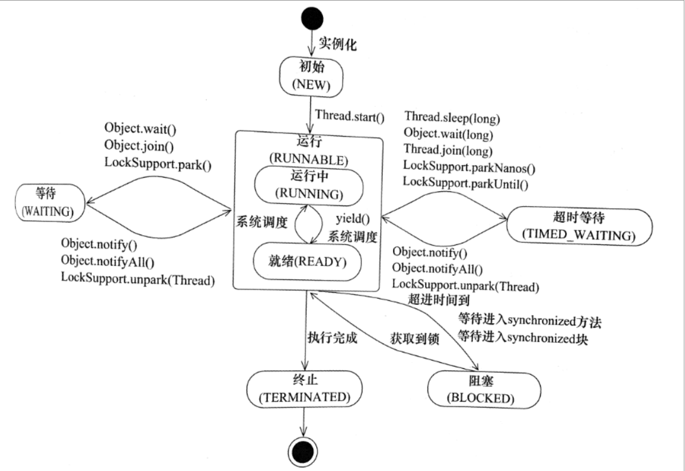

### **11.CAS原理** 

CAS的全称为Compare And Swap，直译就是比较交换。是一条CPU的原子指令，其作用是让CPU先进 

行比较两个值是否相等，然后原子地更新某个位置的值，其实现方式是基于硬件平台的汇编指令，在 

intel的CPU中，使用的是cmpxchg指令，就是说CAS是靠硬件实现的，从而在硬件层面提升效率。 

利用CPU的CAS指令，同时借助JNI来完成Java的非阻塞算法，其它原子操作都是利用类似的特性完成 

的。在 java.util.concurrent 下面的源码中，Atomic, ReentrantLock 都使用了Unsafe类中的方法来保 

证并发的安全性。 

CAS操作是原子性的，所以多线程并发使用CAS更新数据时，可以不使用锁，JDK中大量使用了CAS来更 

新数据而防止加锁来保持原子更新。 

CAS 操作包含三个操作数 ：内存偏移量位置（V）、预期原值（A）和新值(B)。 如果内存位置的值与预 

期原值相匹配，那么处理器会自动将该位置值更新为新值 。否则，处理器不做任何操作。 

CAS操作一般由底层硬件提供
x86的XCHG 指令
Test and Set、Fetch and Add、Load Linked / Store Conditional 

CAS的缺点 

1.只能保证对一个变量的原子性操作 

2.长时间自旋会给CPU带来压力 

3.ABA问题

### **12.重量级锁** 

内置锁在Java中被抽象为监视器锁（monitor）。在JDK 1.6之前，监视器锁可以认为直接对应底层操作 

系统中的互斥量（mutex）。这种同步方式的成本非常高，包括系统调用引起的内核态与用户态切换、 

线程阻塞造成的线程切换等。因此，后来称这种锁为“重量级锁”。 

### **13.自旋锁** 

首先，内核态与用户态的切换上不容易优化。但**通过自旋锁，可以减少线程阻塞造成的线程切换**（包括 

挂起线程和恢复线程）。 

如果锁的粒度小，那么**锁的持有时间比较短**（尽管具体的持有时间无法得知，但可以认为，通常有一部 

分锁能满足上述性质）。那么，对于竞争这些锁的而言，因为锁阻塞造成线程切换的时间与锁持有的时 

间相当，减少线程阻塞造成的线程切换，能得到较大的性能提升。具体如下： 

当前线程竞争锁失败时，打算阻塞自己 

不直接阻塞自己，而是自旋（空等待，比如一个空的有限for循环）一会 

在自旋的同时重新竞争锁 

如果自旋结束前获得了锁，那么锁获取成功；否则，自旋结束后阻塞自己 

如果在自旋的时间内，锁就被旧*owner*释放了，那么当前线程就不需要阻塞自己（也不需要在未来锁释 

放时恢复），减少了一次线程切换。 

“锁的持有时间比较短”这一条件可以放宽。实际上，只要锁竞争的时间比较短（比如线程1快释放锁的时 

候，线程2才会来竞争锁），就能够提高自旋获得锁的概率。这通常发生在**锁持有时间长，但竞争不激** 

**烈**的场景中。 

缺点 

单核处理器上，不存在实际的并行，当前线程不阻塞自己的话，旧owner就不能执行，锁永远不会 

释放，此时不管自旋多久都是浪费；进而，如果线程多而处理器少，自旋也会造成不少无谓的浪 

费。 

自旋锁要占用CPU，如果是计算密集型任务，这一优化通常得不偿失，减少锁的使用是更好的选 

择。 

如果锁竞争的时间比较长，那么自旋通常不能获得锁，白白浪费了自旋占用的CPU时间。这通常发 

生在锁持有时间长，且竞争激烈的场景中，此时应主动禁用自旋锁。 

使用-XX:-UseSpinning参数关闭自旋锁优化；-XX:PreBlockSpin参数修改默认的自旋次数。 

### **14.自适应自旋锁** 

自适应意味着自旋的时间不再固定了，而是由前一次在同一个锁上的自旋时间及锁的拥有者的状态来决 

定： 

如果在同一个锁对象上，自旋等待刚刚成功获得过锁，并且持有锁的线程正在运行中，那么虚拟机 

就会认为这次自旋也很有可能再次成功，进而它将允许自旋等待持续相对更长的时间，比如100个 

循环。 

相反的，如果对于某个锁，自旋很少成功获得过，那在以后要获取这个锁时将可能减少自旋时间甚 

至省略自旋过程，以避免浪费处理器资源。 

**自适应自旋解决的是****“****锁竞争时间不确定****”****的问题**。JVM很难感知到确切的锁竞争时间，而交给用户分析 

就违反了JVM的设计初衷。自适应自旋假定不同线程持有同一个锁对象的时间基本相当，竞争程度趋于 

稳定，因此，可以根据上一次自旋的时间与结果调整下一次自旋的时间。 

缺点 

然而，自适应自旋也没能彻底解决该问题，如果默认的自旋次数设置不合理（过高或过低），那么自适 

应的过程将很难收敛到合适的值。

### **15.轻量级锁** 

自旋锁的目标是降低线程切换的成本。如果锁竞争激烈，我们不得不依赖于重量级锁，让竞争失败的线 

程阻塞；如果完全没有实际的锁竞争，那么申请重量级锁都是浪费的。**轻量级锁的目标是，减少无实际** 

**竞争情况下，使用重量级锁产生的性能消耗**，包括系统调用引起的内核态与用户态切换、线程阻塞造成 

的线程切换等。 

顾名思义，轻量级锁是相对于重量级锁而言的。使用轻量级锁时，不需要申请互斥量，仅仅将*Mark* 

*Word*中的部分字节*CAS*更新指向线程栈中的*Lock Record*，如果更新成功，则轻量级锁获取成功，记录锁 

状态为轻量级锁；否则，说明已经有线程获得了轻量级锁，目前发生了锁竞争（不适合继续使用轻量级 

锁），接下来膨胀为重量级锁。 

Mark Word是对象头的一部分；每个线程都拥有自己的线程栈（虚拟机栈），记录线程和函数调 

用的基本信息。二者属于JVM的基础内容，此处不做介绍。 

当然，由于轻量级锁天然瞄准不存在锁竞争的场景，如果存在锁竞争但不激烈，仍然可以用自旋锁优 

化，自旋失败后再膨胀为重量级锁。 

缺点 

同自旋锁相似： 

如果锁竞争激烈，那么轻量级将很快膨胀为重量级锁，那么维持轻量级锁的过程就成了浪费。 

### **16.偏向锁** 

在没有实际竞争的情况下，还能够针对部分场景继续优化。如果不仅仅没有实际竞争，自始至终，使用 

锁的线程都只有一个，那么，维护轻量级锁都是浪费的。**偏向锁的目标是，减少无竞争且只有一个线程** 

**使用锁的情况下，使用轻量级锁产生的性能消耗**。轻量级锁每次申请、释放锁都至少需要一次CAS，但 

偏向锁只有初始化时需要一次CAS。 

“偏向”的意思是，偏向锁假定将来只有第一个申请锁的线程会使用锁（不会有任何线程再来申请锁）， 

因此，只需要在*Mark Word*中*CAS*记录*owner*（本质上也是更新，但初始值为空），如果记录成功，则偏 

向锁获取成功，记录锁状态为偏向锁，以后当前线程等于*owner*就可以零成本的直接获得锁；否则，说 

明有其他线程竞争，膨胀为轻量级锁。 

偏向锁无法使用自旋锁优化，因为一旦有其他线程申请锁，就破坏了偏向锁的假定。 

缺点 

同样的，如果明显存在其他线程申请锁，那么偏向锁将很快膨胀为轻量级锁。 

> 不过这个副作用已经小的多。 
>
> 如果需要，使用参数-XX:-UseBiasedLocking禁止偏向锁优化（默认打开）


| 锁       | **优点**                                                     | 缺点                                              | 适用场景                               |
| -------- | ------------------------------------------------------------ | ------------------------------------------------- | -------------------------------------- |
| 偏向锁   | 加锁和解锁不需要额外的消耗，和执 行非同步方法比仅存在纳秒级的差距。 | 如果线程间存在锁竞争，会带来额外的锁撤销的消 耗。 | 适用于只有一个线 程访问同步块场 景     |
| 轻量级锁 | 竞争的线程不会阻塞，提高了程序的 响应速度。                  | 如果始终得不到锁竞争的 线程使用自旋会消耗 CPU。   | 追求响应时间。同 步块执行速度非常 快。 |
| 重量级锁 | 线程竞争不使用自旋，不会消耗CPU                              | 线程阻塞，响应时间缓慢                            | 追求吞吐量。同步 块执行速度较长。      |

 

### **17.逃逸分析** 

逃逸分析，是一种可以有效减少Java 程序中同步负载和内存堆分配压力的跨函数全局数据流分析算法。 

通过逃逸分析，Java Hotspot编译器能够分析出一个新的对象的引用的使用范围从而决定是否要将这个 

对象分配到堆上。 逃逸分析的基本行为就是分析对象动态作用域：当一个对象在方法中被定义后，它可 

能被外部方法所引用，例如作为调用参数传递到其他地方中，称为方法逃逸。 

使用逃逸分析，编译器可以对代码做如下优化： 

- 1.**同步省略**。如果一个对象被发现只能从一个线程被访 问到，那么对于这个对象的操作可以不考虑同步。 

- 2.**将堆分配转化为栈分配**。如果一个对象在子程序中被分配，要使指向该对象的指针永远不会逃逸，对 

象可能是栈分配的候选，而不是堆分配。 

- 3.**分离对象或标量替换**。有的对象可能不需要作为一个连续的内存结构存在也可以被访问到， 那么对象 

的部分（或全部）可以不存储在内存，而是存储在CPU寄存器中。 

方法逃逸和线程逃逸 **方法逃逸**(对象逃出当前方法)： 当一个对象在方法里面被定义后，它可能被外部方 法所引用，例如作为调用参数传递到其它方法中。 **线程逃逸**((对象逃出当前线程)： 这个对象甚至可能 被其它线程访问到，例如赋值给类变量或可以在其它线程中访问的实例变量

### 18.线程安全

多线程编程中，有可能会出现多个线程同时访问同一个共享、可变资源的情况；这种资源可能是：对象、变量、文件等。由于线程执行的过程是不可控的，容易产生线程安全问题。

> 当多个线程访问同一个对象时，如果不用考虑这些线程在运行时环境下的调度和交替运行，也不需要进行额外的同步，或者在调用方进行任何其他的协调操作，调用这个对象的行为都可以获取正确的结果，那这个对象是线程安全的。

共享：资源可以由多个线程同时访问
可变：资源可以在其生命周期内被修改

如何解决线程安全问题：  加锁  lock  sychronized
所有的并发模式在解决线程安全问题时，采用的方案都是序列化访问临界资源。

### 19. 并发的优势和风险

#### 19.1 并发编程优势

并发可以将多核CPU的计算能力发挥到极致，提升性能

#### 19.2 并发编程的风险

高并发场景下，频繁的上下文切换反而损耗性能
容易出现死锁
线程安全，多个线程共享数据时可能会产生于期望不相符的结果

- 安全性问题
  多个线程共享数据时可能会产生于期望不相符的结果

- 活跃性问题(Liveness)
  死锁、饥饿、活锁等问题

- 性能问题
  频繁上下文切换、线程同步开销、线程开销

### 20. CPU缓存架构

CPU缓存即高速缓冲存储器，是位于CPU与主内存间的一种容量较小但速度很高的存储器。由于CPU的速度远高于主内存，CPU直接从内存中存取数据要等待一定时间周期，Cache中保存着CPU刚用过或循环使用的一部分数据，当CPU再次使用该部分数据时可从Cache中直接调用,减少CPU的等待时间，提高了系统的效率。

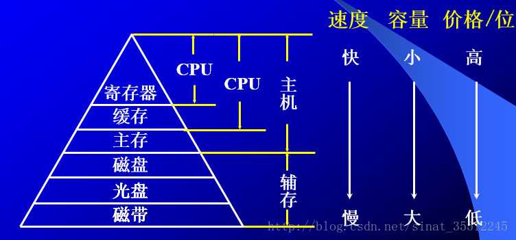

### 21 重排序

重排序有三种类型：
1.编译器优化的重排序
编译器在不改变单线程程序语义的前提下，可以重新安排语句的执行顺序

2.指令级并行的重排序
现代处理器采用了指令级并行技术来将多条指令重叠执行。
如果不存在数据依赖性，处理器可以改变语句对应机器指令的执行顺序

3.内存系统的重排序
由于处理器使用缓存和读/写缓冲区，这使得加载和存储操作看上去可能是在乱序执行

### 22 内存屏障指令

JMM内存屏障插入策略：
1. 在每个volatile写操作的前面插入一个StoreStore屏障
2. 在每个volatile写操作的后面插入一个StoreLoad屏障
3. 在每个volatile读操作的后面插入一个LoadLoad屏障

4.在每个volatile读操作的后面插入一个LoadStore屏障

X86处理器不会对读-读、读-写和写-写操作做重排序, 会省略掉这3种操作类型对应的内存屏障。仅会对写-读操作做重排序，所以volatile写-读操作只需要在volatile写后插入StoreLoad屏障

### 23 顺序一致性

顺序一致性内存模型是一个理论参考模型，在设计的时候，处理器的内存模型和编程语 言的内存模型都会以顺序一致性内存模型作为参照。

顺序一致性（Sequentially Consistent）——即程 序的执行结果与该程序在顺序一致性内存模型中的执行结果相同。

顺序一致性语义

 Lamport提出内存模型：

 R1. 一个线程内的所有操作必须按照程序的顺序来执行

R2：所有线程都只能看到相同的操作执行视图。（同步与否）

 Thread 1:

O1

O2

O3

 Thread 2:

P1

P2

P3

 合法的：O1 P1 O2 P2 O3 P3

O2 O1 P1 P2 P3 O3 

 Total Order: 顺序一致性语义里面，线程的操作之间都是有顺序的。

## 二、JMM

### 2.1 内存模型

> In computing, a memory model describes the interactions of threads through memory and their shared use of the data.

在计算中，内存模型描述线程通过内存的交互以及它们对数据的共享使用。

与编译器有关、与并发有关、与处理器


- 硬件内存模型
  X86
  ARM
- 程序语言内存模型
  Java 
  C++

### 2.2 为什么需要内存模型？

- CPU 缓存和缓存一致性
- 指令重排序

### 2.3 JMM 模型

JMM描述的是是一种抽象的概念，一组规则，通过这组规则控制程序中各个变量在共享数据区域和私有数据区域的访问方式，JMM是围绕原子性、有序性、可见性展开的

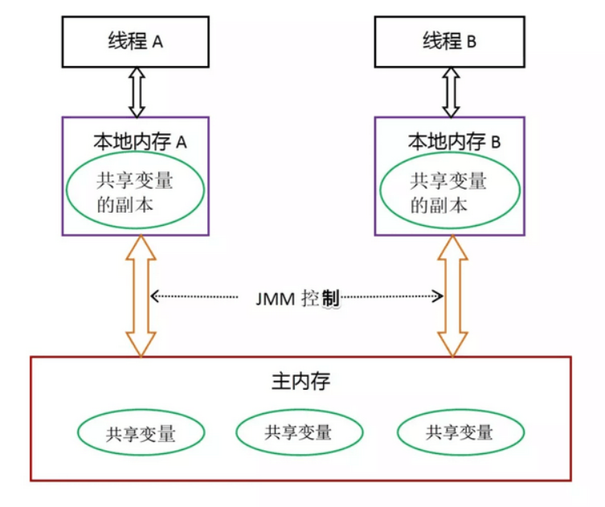


### 2.4 JMM与硬件内存架构的关系

JMM模型跟CPU缓存模型结构类似，是基于CPU缓存模型建立起来的，JMM模型是标准化的，屏蔽掉了底层不同计算机的区别。对于硬件内存来说只有寄存器、缓存内存、主内存的概念，并没有工作内存(线程私有数据区域)和主内存(堆内存)之分，因为JMM只是一种抽象的概念，是一组规则，并不实际存在，不管是工作内存的数据还是主内存的数据，对于计算机硬件来说都会存储在计算机主内存中，当然也有可能存储到CPU缓存或者寄存器中。

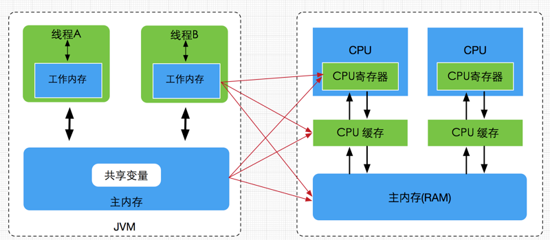

### 2.5 Java内存模型内存交互操作

- lock(锁定)：作用于主内存的变量，把一个变量标记为一条线程独占状态
- unlock(解锁)：作用于主内存的变量，把一个处于锁定状态的变量释放出来，释放后的变量才可以被其他线程锁定
- read(读取)：作用于主内存的变量，把一个变量值从主内存传输到线程的工作内存中，以便随后的load动作使用
- load(载入)：作用于工作内存的变量，它把read操作从主内存中得到的变量值放入工作内存的变量副本
- use(使用)：作用于工作内存的变量，把工作内存中的一个变量值传递给执行引擎
- assign(赋值)：作用于工作内存的变量，它把一个从执行引擎接收到的值赋给工作内存的变量
- store(存储)：作用于工作内存的变量，把工作内存中的一个变量的值传送到主内存中，以便随后的write的操作
- write(写入)：作用于工作内存的变量，它把store操作从工作内存中的一个变量的值传送到主内存的变量中


#### 2.5.1 描述

把一个变量从主内存中复制到工作内存中，就需要按顺序地执行read和load操作，如果把变量从工作内存中同步到主内存中，就需要按顺序地执行store和write操作。但Java内存模型只要求上述8大操作(原子操作)必须按顺序执行，而没有保证必须是连续执行。


#### 2.5.2  Java内存模型内存同步规则

- 不允许一个线程无原因地（没有发生过任何assign操作）把数据从工作内存同步回主内存中
- 一个新的变量只能在主内存中诞生，不允许在工作内存中直接使用一个未被初始化（load或者assign）的变量。即就是对一个变量实施use和store操作之前，必须先自行assign和load操作。
- 一个变量在同一时刻只允许一条线程对其进行lock操作，但lock操作可以被同一线程重复执行多次，多次执行lock后，只有执行相同次数的unlock操作，变量才会被解锁。lock和unlock必须成对出现。
- 如果对一个变量执行lock操作，将会清空工作内存中此变量的值，在执行引擎使用这个变量之前需要重新执行load或assign操作初始化变量的值。
- 如果一个变量事先没有被lock操作锁定，则不允许对它执行unlock操作；也不允许去unlock一个被其他线程锁定的变量。
- 对一个变量执行unlock操作之前，必须先把此变量同步到主内存中（执行store和write操作）

### 2.6 volatile原理

volatile是Java虚拟机提供的轻量级的同步机制
volatile语义有如下两个作用

- 可见性：保证被volatile修饰的共享变量对所有线程总数可见的，也就是当一个线程修改了一个被volatile修饰共享变量的值，新值总是可以被其他线程立即得知。
- 有序性：禁止指令重排序优化。

### 2.7 volatile原理与内存语义

#### 2.7.1 volatile缓存可见性实现原理

JMM内存交互层面：volatile修饰的变量的read、load、use操作和assign、store、write必须是连续的，即修改后必须立即同步会主内存，使用时必须从主内存刷新，由此保证volatile变量的可见性。
底层实现：通过汇编lock前缀指令，它会锁定变量缓存行区域并写回主内存，这个操作称为“缓存锁定”，缓存一致性机制会阻止同时修改被两个以上处理器缓存的内存区域数据。一个处理器的缓存回写到内存内存会导致其他处理器的缓存无效
汇编代码查看

```java
-XX:+UnlockDiagnosticVMOptions -XX:+PrintAssembly -Xcomp
```

#### 2.7.2 有序性&指令重排

java语言规范规定JVM线程内部维持顺序化语义。即只要程序的最终结果与它顺序化情况的结果相等，那么

指令的执行顺序可以与代码顺序不一致，此过程叫指令的重排序。

指令重排序的意义：JVM能根据处理器特性（CPU多级缓存系统、多核处理器等）适当的对机器指令进行重排序，使机器指令能更符合CPU的执行特性，最大限度的发挥机器性能。
在编译器与CPU处理器中都能执行指令重排优化操作


### 2.8 volatile重排序规则


结论：

1.  第二个操作是volatile写，不管第一个操作是什么都不会重排序
2.  第一个操作是volatile读，不管第二个操作是什么都不会重排序
3.  第一个操作是volatile写，第二个操作是volatile读，也不会发生重排序

### 2.9 内存屏障（memory barrier）

JMM内存屏障插入策略：
1. 在每个volatile写操作的前面插入一个StoreStore屏障
2. 在每个volatile写操作的后面插入一个StoreLoad屏障
3. 在每个volatile读操作的后面插入一个LoadLoad屏障

   4.在每个volatile读操作的后面插入一个LoadStore屏障

X86处理器不会对读-读、读-写和写-写操作做重排序, 会省略掉这3种操作类型对应的内存屏障。仅会对写-读操作做重排序，所以volatile写-读操作只需要在volatile写后插入StoreLoad屏障

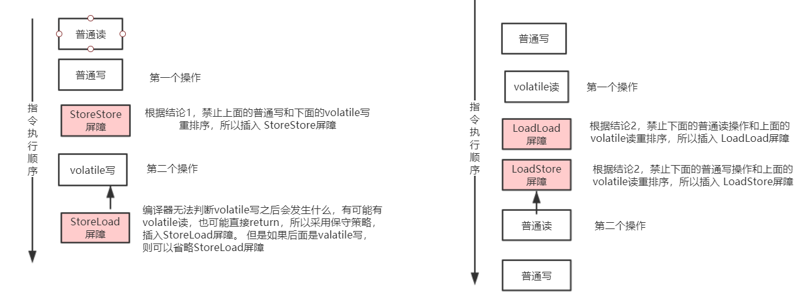


### 2.10 原子性

#### 2.10.1 CAS

CAS，即比较并交换，是一个原子操作
它比较一个内存位置的值,并且只有相等时修改这个内存位置的值为新的值，保证了新的值总是基于最新的信息计算的
如果有其他线程在这期间修改了这个值则CAS失败
CAS返回是否成功或者内存位置原来的值用于判断是否CAS成功
CAS操作一般由底层硬件提供
x86的XCHG 指令
Test and Set、Fetch and Add、Load Linked / Store Conditional 

#### 2.10.2 CAS操作

CAS操作依赖于sun.misc.Unsafe类，它提供了：
compareAndSwapInt
compareAndSwapLong
compareAndSwapObject
getAndAddInt、getAndAddLong、getAndSetInt、getAndSetLong


## 三、锁

### 3.1 锁

- 死锁
  多个线程相互占用对方的资源的锁，而又相互等对方释放锁，此时若无外力干预，这些线程则一直处理阻塞的假死状态，形成死锁
  活锁
  死锁是大家都拿不到资源都占用着对方的资源，而活锁是拿到资源却又相互释放不执行。当多线程中出现了相互谦让，都主动将资源释放给别的线程使用，这样这个资源在多个线程之间跳动而又得不到执行，这就是活锁。

- 饥饿
  如果优先级高的线程一直抢占优先级低线程的资源，导致低优先级线程无法得到执行，这就是饥饿

- 无锁
  即没有对资源进行锁定，即所有的线程都能访问并修改同一个资源，但同时只有一个线程能修改成功

### 3.2 Synchronized和Lock


### 3.3 Synchronized加锁方式

同步实例方法，锁是当前实例对象
同步类方法，锁是当前类对象
同步代码块，锁是括号里面的对象

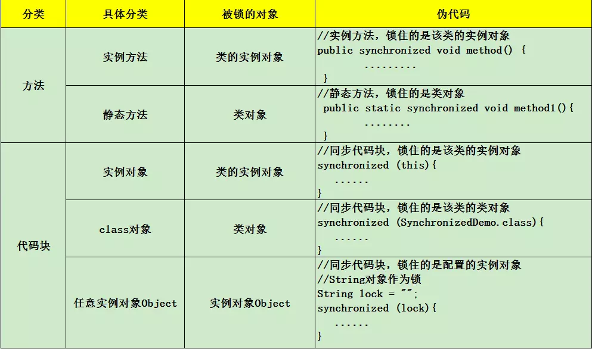

### 3.4 synchronized使用与原理

- 互斥性 ：synchronized修饰的代码块、实例方法、静态方法，多线程并发访问时，只能有一个线程获取到锁，其它线程都处于阻塞等待
- 可见性： 某线程 A 对于进入 同步块之前或在 synchronized 中对于共享变量的操作，对于后续的持有同一个监视器锁的其他线程可见

重量级锁底层原理：
同步方法和同步代码块底层都是通过monitor(监听器)来实现同步的。每个对象都与一个monitor相关联
同步方式是通过方法中的access_flags中设置ACC_SYNCHRONIZED标志来实现；同步代码块是通过monitorenter和monitorexit来实现。两个指令的执行是JVM通过调用操作系统的互斥原语mutex来实现，被阻塞的线程会被挂起、等待重新调度，会导致“用户态和内核态”两个态之间来回切换，对性能有较大影响

Monitor机制

java.lang.Object 类定义了 wait()，notify()，notifyAll() 方法，这些方法的具体实现，依赖于一个叫 ObjectMonitor 模式的实现，这是 JVM 内部基于 C++ 实现的一套机制

monitor 的机制中，monitor object 充当着维护 mutex以及定义 wait/signal API 来管理线程的阻塞和唤醒的角色。任何一个 Java 对象都可以作为 monitor 机制的 monitor object

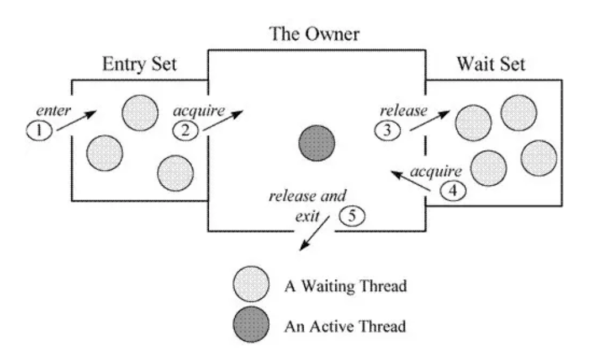

### 3.5 对象内存结构

Java 对象存储在内存中，分别分为三个部分，即对象头、实例数据和对齐填充，
而在其对象头中，保存了锁标识。 


hash： 保存对象的哈希码
age： 保存对象的分代年龄
biased_lock： 偏向锁标识位
lock： 锁状态标识位
Thread ID： 保存持有偏向锁的线程epoch： 保存偏向时间戳

### 3.6 Mark Word

Mark Word就一个非固定的数据结构，以便在极小的空间内存存储尽量多的数据
不同的锁状态，存储着不同的数据，其中变化状态如下（32位虚拟机）

| **锁状态**       | **25 bit**                                           | **4bit**     | **1bit**     | **2bit** |      |
| ---------------- | ---------------------------------------------------- | ------------ | ------------ | -------- | ---- |
| **锁标志位**     |                                                      |              |              |          |      |
| **是否是偏向锁** |                                                      |              |              |          |      |
| **23bit**        | **2bit**                                             |              |              |          |      |
| GC标记           | 空                                                   | 11           |              |          |      |
| 重量级锁         | 指向重量级锁Monitor的指针（依赖Mutex操作系统的互斥） | 10           |              |          |      |
| 轻量级锁         | 指向线程栈中锁记录的指针pointer to Lock Record       | 00           |              |          |      |
| 偏向锁           | 线程ID                                               | Epoch        | 对象分代年龄 | 1        | 01   |
| 无锁             | 对象的hashCode                                       | 对象分代年龄 | 0            | 01       |      |

### 3.7 锁记录（ Lock Record ）

当字节码解释器执行monitorenter字节码轻度锁住一个对象时，就会在获取锁的线程的栈上显式或者隐式分配一个锁记录（ lock record ）,用于存储锁对象的Mark Word的拷贝。
Lock Record是线程私有的数据结构，每一个线程都有一个可用Lock Record列表，同时还有一个全局的可用列表。每一个被锁住的对象Mark Word都会和一个Lock Record关联（对象头的锁记录指针指向Lock Record的起始地址），同时Lock Record中有一个Owner字段存放拥有该锁的线程的唯一标识（object mark word），表示该锁被这个线程占用。


### 3.7 内置锁优化

从JDK6开始，就对synchronized的实现机制进行了较大调整，包括使用JDK5引进的CAS自旋之外，还增加了自适应的CAS自旋、锁消除、锁粗化、偏向锁、轻量级锁这些优化策略。
在 JDK 1.6 中默认是开启偏向锁的，可以通过-XX:-UseBiasedLocking来禁用偏向锁。
使用-XX:-UseSpinning参数关闭自旋锁优化；-XX:PreBlockSpin参数修改默认的自旋次数

偏向锁：无实际竞争，且将来只有第一个申请锁的线程会使用锁。
轻量级锁：无实际竞争，多个线程交替使用锁；允许短时间的锁竞争。
重量级锁：有实际竞争，且锁竞争时间长。

### 3.8 锁优缺点

| **锁**       | **优点**                                                     | **缺点**                                         | **适用场景**                         |
| ------------ | ------------------------------------------------------------ | ------------------------------------------------ | ------------------------------------ |
| **偏向锁**   | 加锁和解锁不需要额外的消耗，和执行非同步方法比仅存在纳秒级的差距。 | 如果线程间存在锁竞争，会带来额外的锁撤销的消耗。 | 适用于只有一个线程访问同步块场景。   |
| **轻量级锁** | 竞争的线程不会阻塞，提高了程序的响应速度。                   | 如果始终得不到锁竞争的线程使用自旋会消耗CPU。    | 追求响应时间。同步块执行速度非常快。 |
| **重量级锁** | 线程竞争不使用自旋，不会消耗CPU。                            | 线程阻塞，响应时间缓慢。                         | 追求吞吐量。同步块执行速度较长。     |

### 3.9 锁优化升级过程

在JDK1.6里锁一共有四种状态，无锁状态，偏向锁状态，轻量级锁状态和重量级锁状态
会随着竞争情况逐渐升级
锁可以升级但不能降级

#### 3.9.1 JVM锁优化 –偏向锁

偏向锁的目标是消除数据在无竞争情况下的同步损耗
当一个线程访问同步块并获取锁时，会在对象头和栈帧中的锁记录里存储锁偏向的线程ID
以后该线程在进入和退出同步块时不需要花费CAS操作来加锁和解锁，而只需简单的测试一下对象头的Mark Word里是否存储着指向当前线程的偏向锁

#### 3.9.2 JVM锁优化 –轻量锁

轻量锁的目标是在没有多线程竞争的前提下，减少传统重量锁使用操作系统互斥量带来的性能损耗
在代码进入同步块的时候，如果同步对象锁状态为无锁状态（锁标志位为“01”状态，是否为偏向锁为“0”）
虚拟机首先将在当前线程的栈帧中建立一个名为锁记录（Lock Record）的空间，用于存储锁对象目前的Mark Word的拷贝，官方称之为 Displaced Mark Word
拷贝对象头中的Mark Word复制到锁记录（Lock Record）中

#### 3.9.3 JVM锁优化 –重量级锁

拷贝成功后，虚拟机将使用CAS操作尝试将锁对象的Mark Word更新为指向Lock Record的指针，并将线程栈帧中的Lock Record里的owner指针指向Object的 Mark Word 
如果这个更新成功，那么这个线程就拥有了该对象的锁，并且对象Mark Word的锁标志位设置为“00”
如果这个更新失败，首先会检查对象的Mark Word是否指向当前线程的栈帧，如果是就说明当前线程已经拥有了这个对象的锁，那就可以直接进入同步块继续执行。否则说明多个线程竞争锁，轻量级锁就要膨胀为重量级锁，锁标志的状态值变为“10”，Mark Word中存储的就是指向重量级锁（互斥量）的指针，后面等待锁的线程也要进入阻塞状态。


### 3.10 同步器（Synchronizer)

#### 3.10.1 描述

临界区（Critical Section）
每个线程中访问临界资源的那段程序称为临界区（Critical Section）
临界资源是一次仅允许一个或指定数量线程使用的共享资源
每次只准许一个或指定数量的线程进入临界区，进入后不允许其他线程进入
竞争条件（Race condition或Race hazard）
在描述一个系统或者进程的输出依赖于不受控制的事件出现顺序或者出现时机
同步器（Synchronizer)
多线程编程中，协调多个线程同时对同一临界资源进行读写的机制
常见同步器？Lock、信号量、Countdownlatch

#### 3.10.2 Java常用同步器（Synchronizer)

几种常用的同步器

```java
Synchronized
ReentrantLock (lock, unlock)
Condition (await and signal)
Semaphore (acquire permits and release)
Future (get -<will block initially and auto release once isDone>)
CyclicBarrier (await – block until a number later auto release)
CountDownLatch (await and countDown)

```


Java 同步器是基于AbstractQueuedSynchronizer(简称AQS)实现的。
AQS是一个抽象同步框架，可以用来实现一个依赖状态的同步器

JDK中提供的大多数的同步器(Synchronizer)如Lock, Latch, Barrier等，都是基于AQS框架来实现
一般是通过一个内部类Sync继承 AQS
将同步器所有调用都映射到Sync对应的方法


## 四、原子变量

### 4.1 原子变量的介绍

#### 4.1.1 变量读写的原子性

Java变量的读写的原子性
基本类型boolean/byte/char/short/int/float的读写是原子的
对引用类型的读写是原子的
基本类型long/double的读写不是原子的
 volatile关键字
 volatile double/volatile long是原子的

#### 4.1.2 如何实现变量复合操作的原子性？

加锁(Synchronized/Lock)
悲观锁
性能开销大

其他方法？
原子变量：无锁、乐观锁、性能开销小

#### 4.1.3 JDK中的原子变量

JDK1.5开始引入，位于java.util.concurrent.atomic包
可以分为以下四种类型：
原子更新基本类型：AtomicBoolean，AtomicInteger，AtomicLong
原子更新数组：，AtomicLongArray，AtomicReferenceArray, AtomicIntegerArray
原子更新类字段：AtomicLongFieldUpdater，AtomicIntegerFieldUpdater，AtomicReferenceFieldUpdater
原子更新引用：AtomicMarkableReference，AtomicStampedReference，AtomicReference

- 原子更新变量-AtomicInteger

- 原子更新数组-AtomicIntegerArray

  原子数组并不是说可以让线程以原子方式一次性地操作数组中多个元素的数组，而是指对于数组中的每个元素，可以以原子方式进行操作。

- 原子更新类字段-AtomicIntegerFieldUpdater

  所谓AtomicXXXFieldUpdater，就是可以以一种线程安全的方式操作非线程安全对象的某些字段。对的字段的要求如下：
  字段必须是volatile类型的
  字段的描述类型（修饰符public/protected/default/private）有要求
  能是实例变量，不能是类变量，也就是说不能加static关键字
  能是可修改变量，不能使final变量，因为final的语义就是不可修改。实际上final的语义和volatile是有冲突的，这两个关键字不能同时存在

- 原子更新引用-AtomicReference

  AtomicReference
  AtomicStampedReference
  AtomicMarkableReference

  为了解决上述的ABA问题，Java提供了两种带版本戳的原子引用类型：
  AtomicStampedReference：带版本戳的原子引用类型，版本戳为int类型。
  AtomicMarkableReference：带版本戳的原子引用类型，版本戳为boolean类型。

### 4.2 高性能并发计数器

Java8新增了高性能并发计数器，包括5个类分别是Striped64，LongAdder，LongAccumulator，DoubleAdder，DoubleAccumulator

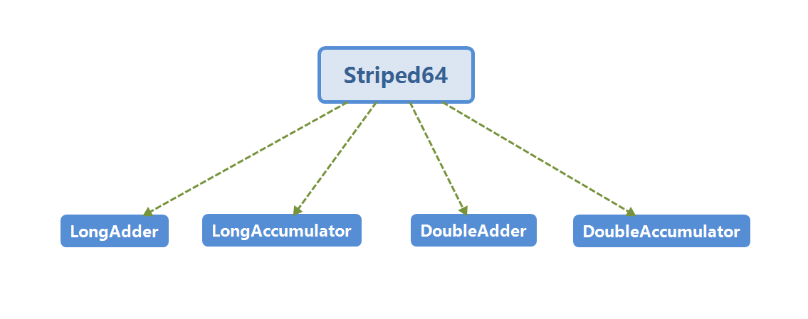


## 五、阻塞队列

## 六、并发编程框架

### 6.1 线程池

一、构造方法 赋值

```java
    public ThreadPoolExecutor(int corePoolSize, 核心数量
                              int maximumPoolSize,非核心数量
                              long keepAliveTime,保持时长
                              TimeUnit unit,时间单位
                              BlockingQueue<Runnable> workQueue,队列 FIFO
                              ThreadFactory threadFactory,线程工程类
                              RejectedExecutionHandler handler)拒绝策略
```


二、submit方法执行

```java
  java.util.concurrent.ThreadPoolExecutor.execute
   >java.util.concurrent.ThreadPoolExecutor.addWorker
   >java.util.concurrent.ThreadPoolExecutor.processWorkerExit 销毁
```


三、拒绝策略

  ```java
java.util.concurrent.RejectedExecutionHandler
  ```


四、定时任务

```java
java.util.concurrent.ThreadPoolExecutor.ensurePrestart 确保 从队列里面取
```

