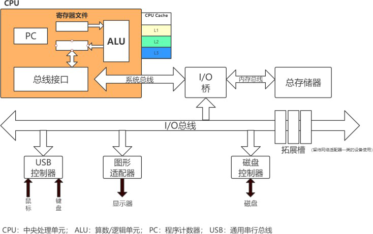
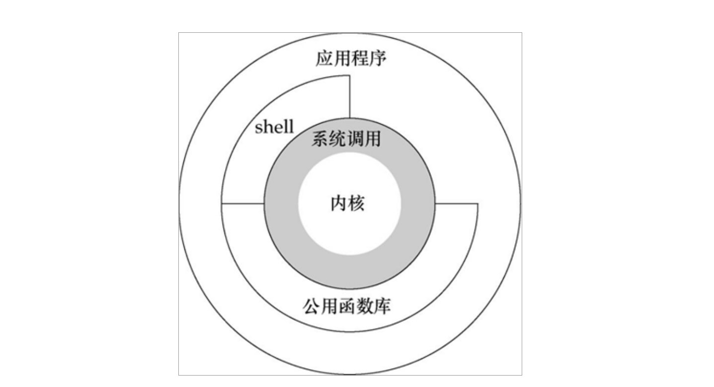

# Java并发编程

## 一、并发编程的基础

### 1.计算机组成原理

冯·诺依曼计算机的特点

- 计算机由运算器、存储器、控制器、输入设备和输出设备五大部件组成

- 指令(程序)和数据以二进制不加区别地存储在存储器中
- 程序自动运行

运算器和控制器封装到一起，加上寄存器组和cpu内部总线构成中央处理器（CPU）。cpu的根本任 务，就是执行指令，对计算机来说，都是0，1组成的序列，cpu从逻辑上可以划分为3个模块：控制单  元、运算单元和存储单元。这三个部分由cpu总线连接起来。

cpu原理图

 

 

CPU的运行原理就是：控制单元在时序脉冲的作用下，将指令计数器里所指向的指令地址(这个地址是在  内存里的)送到地址总线上去，然后CPU将这个地址里的指令读到指令寄存器进行译码。对于执行指令过  程中所需要用到的数据，会将数据地址也送到地址总线，然后CPU把数据读到CPU的内部存储单元(就是 内部寄存器)暂存起来，最后命令运算单元对数据进行处理加工。周而复始，一直这样执行下去。

 

### **2.CPU缓存架构**

**多cup** ： 多个物理CPU，CPU通过总线进行通信，效率比较低。 多cpu的运行，对应进程的运行状态。

**多核cup**： 不同的核可以通过L3 cache进行通信，存储和外设通过总线与CPU通信 。 多核cpu的运行， 对应线程的运行状态。

**CPU寄存器**：每个CPU都包含一系列的寄存器，它们是CPU内内存的基础。CPU在寄存器上执行操作的   速度远大于在主存上执行的速度。这是因为CPU访问寄存器的速度远大于主存。  **CPU缓存**：即高速缓冲存储器，是位于CPU与主内存间的一种容量较小但速度很高的存储器。由于CPU的速度远高于主内存， CPU直接从内存中存取数据要等待一定时间周期，Cache中保存着CPU刚用过或循环使用的一部分数

据，当CPU再次使用该部分数据时可从Cache中直接调用,减少CPU的等待时间，提高了系统的效率。

**内存** ： 一个计算机还包含一个主存，所有的CPU都可以访问主存。主存通常比CPU中的缓存大得多。多cpu和多核cup架构图：

 

 

**缓存一致性问题** 在多处理器系统中，每个处理器都有自己的高速缓存，而它们又共享同一主内存

（MainMemory）。基于高速缓存的存储交互很好地解决了处理器与内存的速度矛盾，但是也引入了新  的问题：缓存一致性（CacheCoherence）。当多个处理器的运算任务都涉及同一块主内存区域时，将   可能导致各自的缓存数据不一致的情况，如果真的发生这种情况，那同步回到主内存时以谁的缓存数据  为准呢？为了解决一致性的问题，需要各个处理器访问缓存时都遵循一些协议，在读写时要根据协议来  进行操作，这类协议有MSI、   MESI（IllinoisProtocol）、MOSI、Synapse、Firefly及DragonProtocol 等等。

### **3.进程和线程**

进程是程序的一次执行，一个程序有至少一个进程，是**资源分配的最小单位**，资源分配包括cpu、内 存、磁盘IO等。线程是**程序执行的最小单位**,**CPU调度的基本单元**，一个进程有至少一个线程。

（1）进程是资源的分配和调度的一个独立单元，而线程是CPU调度的基本单元   

（2）同一个进程中可以包括多个线程，并且线程共享整个进程的资源（寄存器、堆栈、上下文），一个进行至少包括一个线程。  

（3）进程的创建调用fork或者vfork，而线程的创建调用pthread_create，进程结束后它拥有的所有线程都将销毁，而线程的结束不会影响同个进程中的其他线程的结束  

（4）线程是轻两级的进程，它的创建和销毁所需要的时间比进程小很多，所有操作系统中的执行功能都是创建线程去完成的  

（5）线程中执行时一般都要进行同步和互斥，因为他们共享同一进程的所有资源  

（6）线程有自己的私有属性线程控制块TCB，线程id，寄存器、上下文，而进程也有自己的私有属性进程控制块PCB，这些私有属   性是不被共享的，用来标示一个进程或一个线程的标志

 

 

 

### **4.并发和并行**

目标都是最大化CPU的使用率

**并行(parallel)**看，二者都是一起执行的。

 

**并发(concurrency)**：指在同一时刻只能有一条指令执行，但多个进程指令被快速的轮换执行，使得在   宏观上具有多个进程同时执行的效果，但在微观上并不是同时执行的，只是把时间分成若干段，使多个  进程快速交替的执行。

 

并行在多处理器系统中存在，而并发可以在单处理器和多处理器系统中都存在，并发能够在单处理器系  统中存在是因为并发是并行的假象，并行要求程序能够同时执行多个操作，而并发只是要求程序假装同  时执行多个操作（每个小时间片执行一个操作，多个操作快速切换执行）

 

### **5.线程上下文切换**

线程上下文的切换巧妙的利用了**时间片轮转**CPU**线程状态的保存及其再加载，就**  。时间片轮询保证的利用率。

**上下文**：是指再某一时间CPU寄存器和程序计数器的内容；

**寄存器**：是CPU内部数量少但是速度很快的内存。寄存器通常对常用值的快速访问来提高计算机程序运  行的速度；

**程序计数器**：是一个专门的寄存器，用于表明系统中CPU的执行位置，存的值为正在执行的指令或者下  一个需要被执行的指令的位置。

**上下文切换的活动**：

-  a.挂起一个线程，将这个进程在CPU中的状态存储于内存中的某处； 

- b.在内存中检索下一个进程的上下文并将其CPU的寄存器恢复；

- c.跳转到程序计数器所指定的位置；

 

### **6.编译原理**

在编译原理中, 将源代码编译成机器码, 主要经过下面几个步骤:

在Java中**前端编译**是指把**.java**文件转变成**.class**文件的过程; **后端编译**是指把字节码转变成机器码的过 

程。 

前端编译就是javac命令。 

在后端编译阶段， JVM 通过解释字节码将其翻译成对应的机器指令，逐条读入，逐条解释翻译 。 很显 

然，经过**解释执行**，其执行速度必然会比可执行的二进制字节码程序慢很多。这就是传统的JVM的解释 

器（Interpreter）的功能。为了解决这种效率问题，引入了 JIT（即时编译） 技术。 

JAVA程序还是通过解释器进行解释执行，当JVM发现某个方法或代码块运行特别频繁的时候，就会认为 

这是“热点代码”（Hot Spot Code)。然后JIT会把部分“热点代码”**翻译**成本地机器相关的机器码，并进行 

**优化**，然后再把翻译后的机器码**缓存**起来，以备下次使用。 

**JIT(Just In Time Compiler)工作原理**：

工作原理.PNG)

热点探测 （Hot Spot Detection） 

触发JIT，需要识别出热点代码， 有两种方式基于采样的方式探测（Sample Based Hot Spot Detection) ：周期性检测各个线程的栈顶， 

发现某个方法经常出现在栈顶，就认为是热点方法。好处就是简单，缺点就是无法精确确认 

一个方法的热度。容易受线程阻塞或别的原因干扰热点探测。 

基于计数器的热点探测（Counter Based Hot Spot Detection)。采用这种方法的虚拟机会为 

每个方法，甚至是代码块建立计数器，统计方法的执行次数，某个方法超过阀值就认为是热 

点方法，触发JIT编译。 

在HotSpot虚拟机中使用的是第二种——基于计数器的热点探测方法，因此它为每个方法准备了两个计 

数器：方法调用计数器和回边计数器。 

方法计数器：就是记录一个方法被调用次数的计数器。 

回边计数器：是记录方法中的for或者while的运行次数的计数器。 

编译优化 

JIT除了具有缓存的功能外，还会对代码做各种优化。比如 逃逸分析、 锁消除、 锁膨胀、 方法内 

联、 空值检查消除、 类型检测消除、 公共子表达式消除 。 

### **7.安全点** 

safepoint可以用在不同地方，比如GC、Deoptimization，在HotspotVM中，GC safepoint比较常见， 

需要一个数据结构记录每个线程的调用栈、寄存器等一些重要的数据区域里什么地方包含了GC管理的 

指针。 

从线程角度看，safepoint可以理解成是**在代码执行过程中的一些特殊位置，当线程执行到这些位置的** 

**时候，说明虚拟机当前的状态是安全的，如果有需要，可以在这个位置暂停**，比如发生GC时，需要暂 

停所有活动线程，但是该线程在这个时刻，还没有执行到一个安全点，所以该线程应该继续执行，到达 

下一个安全点的时候暂停，然后才开始GC，该线程等待GC结束。 

**安全点的选取** 

在OppMaps的帮助下，虚拟机能够迅速的完成GCRoots的枚举，但是如果每一条指令都生成对应的 

OppMaps，那就需要大量的额外空间。 

所以，程序在执行的时候并非在所有地方都能停顿下来gc，只有到达安全点才能停顿。安全点的选定是 

以“是否具有让程序长时间执行的特性”为标准，因为安全点过少的话gc停顿时间就会很长，安全点过多 

又会增加运行时负荷。”长时间执行“最明显的特征就是指令序列复用，如方法调用，循环跳转，异常跳 

转等。所有这些功能的指令才会产生安全点。 

**线程的停顿** 

在gc发生时让所有线程跑到最近的安全点后停顿。 两种思路： 第一种,抢先式中断,gc发生时，让所有线 

程中断，如果有线程不在安全点，那么让线程跑到安全点。 第二种,主动式中断，设置一个标识，各个 

线程执行时不断轮询这个标志，发现标志时就自动挂起，轮询标志的地方和安全点重合。 

**安全区域** 

安全点机制保证了程序执行的时候，在不太长的时间就会遇到可进入gc的安全点。但是如果线程处于 

sleep状态或者blocked状态的时候，这时线程无法响应jvm的中断请求，就需要安全区域。 

安全区域是指在一段代码片段中，引用关系不会发生变化，在该区域的任何地方发生gc都是安全的。 当 

代码执行到安全区域时，首先标示自己已经进入了安全区域，那样如果在这段时间里jvm发起gc，就不 

用管标示自己在安全区域的那些线程了，在线程离开安全区域时，会检查系统是否正在执行gc，如果是 

那么就等到gc完成后再离开安全区域。 

### **8.happens-before**

从JDK 5 开始，JMM使用happens-before的概念来阐述多线程之间的内存可见性。**在****JMM****中，如果一** 

**个操作执行的结果需要对另一个操作可见，那么这两个操作之间必须存在****happens-before****关系。** 

happens-before和JMM关系如下图： 

**happens-before原则定义如下**： 

- 如果一个操作happens-before另一个操作，那么第一个操作的执行结果将对第二个操作可见，而 

且第一个操作的执行顺序排在第二个操作之前。 

- 两个操作之间存在happens-before关系，并不意味着一定要按照happens-before原则制定的顺序 

来执行。如果重排序之后的执行结果与按照happens-before关系来执行的结果一致，那么这种重 

排序并不非法。

**happens-before原则规则**：

- 1.程序次序规则：一个线程内，按照代码顺序，书写在前面的操作先行发生于书写在后面的操作； 

- 2.锁定规则：一个unLock操作先行发生于后面对同一个锁的lock操作； 

- 3.volatile变量规则：对一个变量的写操作先行发生于后面对这个变量的读操作；
- 4.传递规则：如果操作A先行发生于操作B，而操作B又先行发生于操作C，则可以得出操作A先行发生于操作 C；

- 5.线程启动规则：Thread对象的start()方法先行发生于此线程的每个一个动作； 

- 6.线程中断规则：对线程interrupt()方法的调用先行发生于被中断线程的代码检测到中断事件的发生； 

- 7.线程终结规则：线程中所有的操作都先行发生于线程的终止检测，我们可以通过Thread.join()方法结 束、Thread.isAlive()的返回值手段检测到线程已经终止执行； 

- 8.对象终结规则：一个对象的初始化完成先行发生于他的finalize()方法的开始；

>  我们来详细看看上面每条规则（摘自《深入理解Java虚拟机第12章》）： 
>
> **程序次序规则**：一段代码在单线程中执行的结果是有序的。注意是执行结果，因为虚拟机、处理器会对 
>
> 指令进行重排序（重排序后面会详细介绍）。虽然重排序了，但是并不会影响程序的执行结果，所以程 
>
> 序最终执行的结果与顺序执行的结果是一致的。故而这个规则只对单线程有效，在多线程环境下无法保 
>
> 证正确性。 
>
> **锁定规则**：这个规则比较好理解，无论是在单线程环境还是多线程环境，一个锁处于被锁定状态，那么 
>
> 必须先执行unlock操作后面才能进行lock操作。 
>
> **volatile变量规则**：这是一条比较重要的规则，它标志着volatile保证了线程可见性。通俗点讲就是如果 
>
> 一个线程先去写一个volatile变量，然后一个线程去读这个变量，那么这个写操作一定是happens
>
> before读操作的。 
>
> **传递规则**：提现了happens-before原则具有传递性，即A happens-before B , B happens-before C， 
>
> 那么A happens-before C 
>
> **线程启动规则**：假定线程A在执行过程中，通过执行ThreadB.start()来启动线程B，那么线程A对共享变 
>
> 量的修改在接下来线程B开始执行后确保对线程B可见。 
>
> **线程终结规则**：假定线程A在执行的过程中，通过制定ThreadB.join()等待线程B终止，那么线程B在终 
>
> 止之前对共享变量的修改在线程A等待返回后可见。 

**上面八条是原生Java满足Happens-before关系的规则，但是我们可以对他们进行推导出其他满足** 

**happens-before**的规则： 

1.将一个元素放入一个线程安全的队列的操作Happens-Before从队列中取出这个元素的操作 

2.将一个元素放入一个线程安全容器的操作Happens-Before从容器中取出这个元素的操作 

3.在CountDownLatch上的倒数操作Happens-Before CountDownLatch#await()操作 

4.释放Semaphore许可的操作Happens-Before获得许可操作 

5.Future表示的任务的所有操作Happens-Before Future#get()操作 

6.向Executor提交一个Runnable或Callable的操作Happens-Before任务开始执行操作 

### **9.用户态和内核态** 

Linux的架构中，很重要的一个能力就是操纵系统资源的能力。但是，系统资源是有限的，如果不加限 

制的允许任何程序以任何方式去操纵系统资源，必然会造成资源的浪费，发生资源不足等情况。为了减 

少这种情况的发生，Linux制定了一个等级制定，即特权。Linux将特权分成两个层次，以0和3标识。0 

的特权级要高于3。换句话说，0特权级在操纵系统资源上是没有任何限制的，可以执行任何操作，而 

3，则会受到极大的限制。我们把特权级0称之为内核态，特权级3称之为用户态。 

Intel x86架构使用了4个级别来标明不同的特权级权限。R0实际就是内核态，拥有最高权限。而一般应 

用程序处于R3状态--用户态。在Linux中，还存在R1和R2两个级别，一般归属驱动程序的级别。在 

Windows平台没有R1和R2两个级别，只用R0内核态和R3用户态。在权限约束上，使用的是高特权等级 

状态可以阅读低等级状态的数据，例如进程上下文、代码、数据等等，但是反之则不可。R0最高可以读 

取R0-3所有的内容，R1可以读R1-3的，R2以此类推，R3只能读自己的数据。 

应用程序一般会在以下几种情况下切换到内核态： 

1． 系统调用。 

2． 异常事件。当发生某些预先不可知的异常时，就会切换到内核态，以执行相关的异常事件。 

3． 设备中断。在使用外围设备时，如外围设备完成了用户请求，就会向CPU发送一个中断信号，此 

时，CPU就会暂停执行原本的下一条指令，转去处理中断事件。此时，如果原来在用户态，则自然就会 

切换到内核态。

**用户线程**：指不需要内核支持而在用户程序中实现的线程，其不依赖于操作系统核心，应用进程利用线 

程库提供创建、同步、调度和管理线程的函数来控制用户线程。另外，用户线程是由应用进程利用线程 

库创建和管理，不依赖于操作系统核心。不需要用户态/核心态切换，速度快。操作系统内核不知道多 

线程的存在，因此**一个线程阻塞将使得整个进程（包括它的所有线程）阻塞**。由于这里的处理器时间片 

分配是以进程为基本单位，所以每个线程执行的时间相对减少。 **内核线程**： 线程的所有管理操作都是 

由操作系统内核完成的。内核保存线程的状态和上下文信息，当一个线程执行了引起阻塞的系统调用 

时，内核可以调度该进程的其他线程执行。在多处理器系统上，内核可以分派属于同一进程的多个线程 

在多个处理器上运行，提高进程执行的并行度。由于需要内核完成线程的创建、调度和管理，所以和用 

户级线程相比这些操作要慢得多，但是仍然比进程的创建和管理操作要快。大多数市场上的操作系统， 

如Windows，Linux等都支持内核级线程。 

### **10.JVM线程调度** 

**JVM线程调度**：依赖JVM内部实现，主要是Native thread scheduling，是依赖操作系统的，所以java也 

不能完全是跨平台独立的，对线程调度处理非常敏感的业务开发必须关注底层操作系统的线程调度差 

异，所以理解线程的时候，一个线程是java线程对象，一个是调度器的线程（jvm）。 

**Green Thread Schedule** **或者叫用户级线程（User Level Thread，ULT）：**操作系统内核不知道应 

用线程的存在。 

**Native thread scheduling** **或者 内核级线程（Kernel Level Thread** ，KLT）：它们是依赖于内核 

的，即无论是用户进程中的线程，还是系统进程中的线程，它们的创建、撤消、切换都由内核实现。

Java线程与系统内核线程关系 ：

**JVM**中创建线程有2种方式

1. new java.lang.Thread().start() 

2. 使用JNI将一个native thread attach到JVM中 

   针对 new java.lang.Thread().start()这种方式，只有调用start()方法的时候，才会真正的在JVM中去创建 

线程，主要的生命周期步骤有： 

- 创建对应的JavaThread的instance 

-  创建对应的OSThread的instance 

- 创建实际的底层操作系统的native thread 

- 准备相应的JVM状态，比如ThreadLocal存储空间分配等 

-  底层的native thread开始运行，调用java.lang.Thread生成的Object的run()方法 

- 当java.lang.Thread生成的Object的run()方法执行完毕返回后,或者抛出异常终止后， 终止native 

thread 

针对JNI将一个native thread attach到JVM中，主要的步骤有：

-  通过JNI call AttachCurrentThread申请连接到执行的JVM实例 

- JVM创建相应的JavaThread和OSThread对象 

- 创建相应的java.lang.Thread的对象 

-  一旦java.lang.Thread的Object创建之后，JNI就可以调用Java代码了 

- 当通过JNI call DetachCurrentThread之后，JNI就从JVM实例中断开连接 

- JVM清除相应的JavaThread, OSThread, java.lang.Thread对象 

**线程生命周期**

### **11.CAS原理** 

CAS的全称为Compare And Swap，直译就是比较交换。是一条CPU的原子指令，其作用是让CPU先进 

行比较两个值是否相等，然后原子地更新某个位置的值，其实现方式是基于硬件平台的汇编指令，在 

intel的CPU中，使用的是cmpxchg指令，就是说CAS是靠硬件实现的，从而在硬件层面提升效率。 

利用CPU的CAS指令，同时借助JNI来完成Java的非阻塞算法，其它原子操作都是利用类似的特性完成 

的。在 java.util.concurrent 下面的源码中，Atomic, ReentrantLock 都使用了Unsafe类中的方法来保 

证并发的安全性。 

CAS操作是原子性的，所以多线程并发使用CAS更新数据时，可以不使用锁，JDK中大量使用了CAS来更 

新数据而防止加锁来保持原子更新。 

CAS 操作包含三个操作数 ：内存偏移量位置（V）、预期原值（A）和新值(B)。 如果内存位置的值与预 

期原值相匹配，那么处理器会自动将该位置值更新为新值 。否则，处理器不做任何操作。 

CAS的缺点 

1.只能保证对一个变量的原子性操作 

2.长时间自旋会给CPU带来压力 

3.ABA问题

### **12.重量级锁** 

内置锁在Java中被抽象为监视器锁（monitor）。在JDK 1.6之前，监视器锁可以认为直接对应底层操作 

系统中的互斥量（mutex）。这种同步方式的成本非常高，包括系统调用引起的内核态与用户态切换、 

线程阻塞造成的线程切换等。因此，后来称这种锁为“重量级锁”。 

### **13.自旋锁** 

首先，内核态与用户态的切换上不容易优化。但**通过自旋锁，可以减少线程阻塞造成的线程切换**（包括 

挂起线程和恢复线程）。 

如果锁的粒度小，那么**锁的持有时间比较短**（尽管具体的持有时间无法得知，但可以认为，通常有一部 

分锁能满足上述性质）。那么，对于竞争这些锁的而言，因为锁阻塞造成线程切换的时间与锁持有的时 

间相当，减少线程阻塞造成的线程切换，能得到较大的性能提升。具体如下： 

当前线程竞争锁失败时，打算阻塞自己 

不直接阻塞自己，而是自旋（空等待，比如一个空的有限for循环）一会 

在自旋的同时重新竞争锁 

如果自旋结束前获得了锁，那么锁获取成功；否则，自旋结束后阻塞自己 

如果在自旋的时间内，锁就被旧*owner*释放了，那么当前线程就不需要阻塞自己（也不需要在未来锁释 

放时恢复），减少了一次线程切换。 

“锁的持有时间比较短”这一条件可以放宽。实际上，只要锁竞争的时间比较短（比如线程1快释放锁的时 

候，线程2才会来竞争锁），就能够提高自旋获得锁的概率。这通常发生在**锁持有时间长，但竞争不激** 

**烈**的场景中。 

缺点 

单核处理器上，不存在实际的并行，当前线程不阻塞自己的话，旧owner就不能执行，锁永远不会 

释放，此时不管自旋多久都是浪费；进而，如果线程多而处理器少，自旋也会造成不少无谓的浪 

费。 

自旋锁要占用CPU，如果是计算密集型任务，这一优化通常得不偿失，减少锁的使用是更好的选 

择。 

如果锁竞争的时间比较长，那么自旋通常不能获得锁，白白浪费了自旋占用的CPU时间。这通常发 

生在锁持有时间长，且竞争激烈的场景中，此时应主动禁用自旋锁。 

使用-XX:-UseSpinning参数关闭自旋锁优化；-XX:PreBlockSpin参数修改默认的自旋次数。 

### **14.自适应自旋锁** 

自适应意味着自旋的时间不再固定了，而是由前一次在同一个锁上的自旋时间及锁的拥有者的状态来决 

定： 

如果在同一个锁对象上，自旋等待刚刚成功获得过锁，并且持有锁的线程正在运行中，那么虚拟机 

就会认为这次自旋也很有可能再次成功，进而它将允许自旋等待持续相对更长的时间，比如100个 

循环。 

相反的，如果对于某个锁，自旋很少成功获得过，那在以后要获取这个锁时将可能减少自旋时间甚 

至省略自旋过程，以避免浪费处理器资源。 

**自适应自旋解决的是****“****锁竞争时间不确定****”****的问题**。JVM很难感知到确切的锁竞争时间，而交给用户分析 

就违反了JVM的设计初衷。自适应自旋假定不同线程持有同一个锁对象的时间基本相当，竞争程度趋于 

稳定，因此，可以根据上一次自旋的时间与结果调整下一次自旋的时间。 

缺点 

然而，自适应自旋也没能彻底解决该问题，如果默认的自旋次数设置不合理（过高或过低），那么自适 

应的过程将很难收敛到合适的值。

### **15.轻量级锁** 

自旋锁的目标是降低线程切换的成本。如果锁竞争激烈，我们不得不依赖于重量级锁，让竞争失败的线 

程阻塞；如果完全没有实际的锁竞争，那么申请重量级锁都是浪费的。**轻量级锁的目标是，减少无实际** 

**竞争情况下，使用重量级锁产生的性能消耗**，包括系统调用引起的内核态与用户态切换、线程阻塞造成 

的线程切换等。 

顾名思义，轻量级锁是相对于重量级锁而言的。使用轻量级锁时，不需要申请互斥量，仅仅将*Mark* 

*Word*中的部分字节*CAS*更新指向线程栈中的*Lock Record*，如果更新成功，则轻量级锁获取成功，记录锁 

状态为轻量级锁；否则，说明已经有线程获得了轻量级锁，目前发生了锁竞争（不适合继续使用轻量级 

锁），接下来膨胀为重量级锁。 

Mark Word是对象头的一部分；每个线程都拥有自己的线程栈（虚拟机栈），记录线程和函数调 

用的基本信息。二者属于JVM的基础内容，此处不做介绍。 

当然，由于轻量级锁天然瞄准不存在锁竞争的场景，如果存在锁竞争但不激烈，仍然可以用自旋锁优 

化，自旋失败后再膨胀为重量级锁。 

缺点 

同自旋锁相似： 

如果锁竞争激烈，那么轻量级将很快膨胀为重量级锁，那么维持轻量级锁的过程就成了浪费。 

### **16.偏向锁** 

在没有实际竞争的情况下，还能够针对部分场景继续优化。如果不仅仅没有实际竞争，自始至终，使用 

锁的线程都只有一个，那么，维护轻量级锁都是浪费的。**偏向锁的目标是，减少无竞争且只有一个线程** 

**使用锁的情况下，使用轻量级锁产生的性能消耗**。轻量级锁每次申请、释放锁都至少需要一次CAS，但 

偏向锁只有初始化时需要一次CAS。 

“偏向”的意思是，偏向锁假定将来只有第一个申请锁的线程会使用锁（不会有任何线程再来申请锁）， 

因此，只需要在*Mark Word*中*CAS*记录*owner*（本质上也是更新，但初始值为空），如果记录成功，则偏 

向锁获取成功，记录锁状态为偏向锁，以后当前线程等于*owner*就可以零成本的直接获得锁；否则，说 

明有其他线程竞争，膨胀为轻量级锁。 

偏向锁无法使用自旋锁优化，因为一旦有其他线程申请锁，就破坏了偏向锁的假定。 

缺点 

同样的，如果明显存在其他线程申请锁，那么偏向锁将很快膨胀为轻量级锁。 

> 不过这个副作用已经小的多。 
>
> 如果需要，使用参数-XX:-UseBiasedLocking禁止偏向锁优化（默认打开）

| 锁       | **优点**                                                     | 缺点                                              | 适用场景                               |
| -------- | ------------------------------------------------------------ | ------------------------------------------------- | -------------------------------------- |
| 偏向锁   | 加锁和解锁不需要额外的消耗，和执 行非同步方法比仅存在纳秒级的差距。 | 如果线程间存在锁竞争，会带来额外的锁撤销的消 耗。 | 适用于只有一个线 程访问同步块场 景     |
| 轻量级锁 | 竞争的线程不会阻塞，提高了程序的 响应速度。                  | 如果始终得不到锁竞争的 线程使用自旋会消耗 CPU。   | 追求响应时间。同 步块执行速度非常 快。 |
| 重量级锁 | 线程竞争不使用自旋，不会消耗CPU                              | 线程阻塞，响应时间缓慢                            | 追求吞吐量。同步 块执行速度较长。      |

 

### **17.逃逸分析** 

逃逸分析，是一种可以有效减少Java 程序中同步负载和内存堆分配压力的跨函数全局数据流分析算法。 

通过逃逸分析，Java Hotspot编译器能够分析出一个新的对象的引用的使用范围从而决定是否要将这个 

对象分配到堆上。 逃逸分析的基本行为就是分析对象动态作用域：当一个对象在方法中被定义后，它可 

能被外部方法所引用，例如作为调用参数传递到其他地方中，称为方法逃逸。 

使用逃逸分析，编译器可以对代码做如下优化： 

- 1.**同步省略**。如果一个对象被发现只能从一个线程被访 问到，那么对于这个对象的操作可以不考虑同步。 

- 2.**将堆分配转化为栈分配**。如果一个对象在子程序中被分配，要使指向该对象的指针永远不会逃逸，对 

象可能是栈分配的候选，而不是堆分配。 

- 3.**分离对象或标量替换**。有的对象可能不需要作为一个连续的内存结构存在也可以被访问到， 那么对象 

的部分（或全部）可以不存储在内存，而是存储在CPU寄存器中。 

方法逃逸和线程逃逸 **方法逃逸**(对象逃出当前方法)： 当一个对象在方法里面被定义后，它可能被外部方 法所引用，例如作为调用参数传递到其它方法中。 **线程逃逸**((对象逃出当前线程)： 这个对象甚至可能 被其它线程访问到，例如赋值给类变量或可以在其它线程中访问的实例变量

## 二、锁

## 三、原子变量

## 四、阻塞队列

## 五、并发编程框架